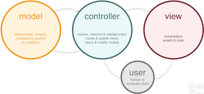
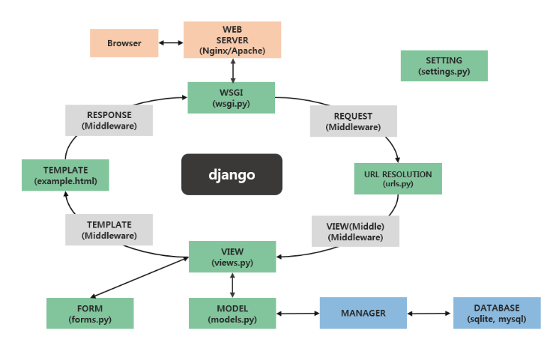

# Django 초보 가이드 - 실습을 통해 알아보는 장고 입문 정리노트

[강의링크](https://www.inflearn.com/course/django-%EC%B4%88%EB%B3%B4-%EA%B0%80%EC%9D%B4%EB%93%9C-%EC%8B%A4%EC%8A%B5%EC%9D%84-%ED%86%B5%ED%95%B4-%EC%95%8C%EC%95%84%EB%B3%B4%EB%8A%94-%EC%9E%A5%EA%B3%A0-%EC%9E%85%EB%AC%B8/dashboard)

---

## 개념

### MVC & MTP

두개가 거의 동일하다고 생각하면 된다!

- **M**odel: 안전하게 데이터를 저장
- **V**iew: 데이터를 적절하게 유저에게 보여줌
- **C**ontrol, **T**emplate(Django): 사용자의 입력과 이벤트에 반응하여 Model과 View를 업데이트

[이미지 출처](https://www.essenceandartifact.com/2012/12/the-essence-of-mvc.html)

### Django 전체 플로우

[이미지 출처](https://mkjjo.github.io/etc/2019/01/05/django_operation_method.html)

- 녹색 파일: 실제로 우리가 다루게 될 파일들
  - **WSGI**: gateway interface로, 브라우저의 신호를 받고 웹서버와 장고를 적절히 결합 시켜주는 역할
  - **URL RESOLUTION**: 정규 표현식으로 구성되어 있으며 이에 맞게끔 특정한 뷰로 보내주는 역할
  - **VIEW**: 실질적으로 코드를 작성하게 될 파일로, 사용자 요청에 의해 데이터베이스에 데이터를 입력을 하던지, 데이터베이스에서 데이터를 갖고와서 사용자에게 리스트를 보여줄 건지 판단하는 역할. 판단 후 모델에 신호를 보냄
  - **MODEL**: 변수 지정만 하면 데이터베이스를 관리
  - **TEMPLATE**: HTML 파일로 UI 작업을 할 수 있음
  - **FORM**: Model과 Tamplate 손쉽게 관리
- 하얀색 파일: middleware라고 우리가 느낄 수는 없지만 장고 뒤에서 다양한 처리를 도와줌

---

## Project와 App

- project 생성
  `$ django-admin startproject tutorial`
- app 생성
  `$ ./manage.py startapp community`
  - 프로젝트 내부에 다수의 app 생성

---

## settings.py

프로젝트 환경 설정 파일

- **DEBUG**
  - 디버그 모드 설정
  - true: 다양한 변수들의 상태 확인 가능, 개발할 때 설정
  - false: 실질적으로 프로그램을 배포할 때 설정
- **INSTALLED_APPS**
  - pip로 설치한 앱 또는 본인이 만든 app을 추가
- **MIDDELWARE_CLASSES**
  - request와 response 사이의 주요 기능 레이어
  - 크게 신경쓰지 않아도 됨
- **TEMPLATES**
  - django template 관련 설정, 실제 뷰(html, 변수)
- **DATABASES**
  - 데이터베이스 엔진의 연결 설정
  - 어댑터에 맞게 설정
- **STATIC_URL**
  - 정적 파일의 URL(css, javascript, image, etc)

---

## manage.py

- 프로젝트 관리 명령어 모음
- 주요 명령어
  - startapp: 앱 생성
  - runserver: 서버 생성
  - createsuperuser: 관리자 생성
  - makemigrations app: app의 모델 변경 사항 체크
  - migrate: 변경 사항을 DB에 반영
  - shell: 쉘을 통해 데이터를 확인
  - collectstatic: static 파일을 한 곳에 모음
- ex) `./manage/py runserver 0.0.0.0:8080`
