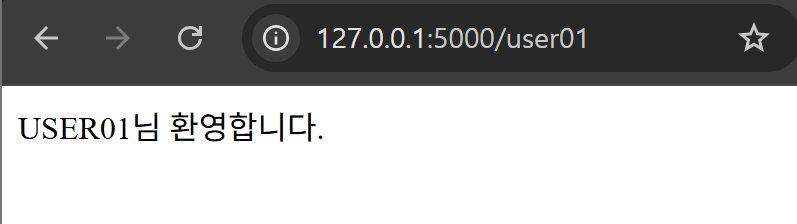
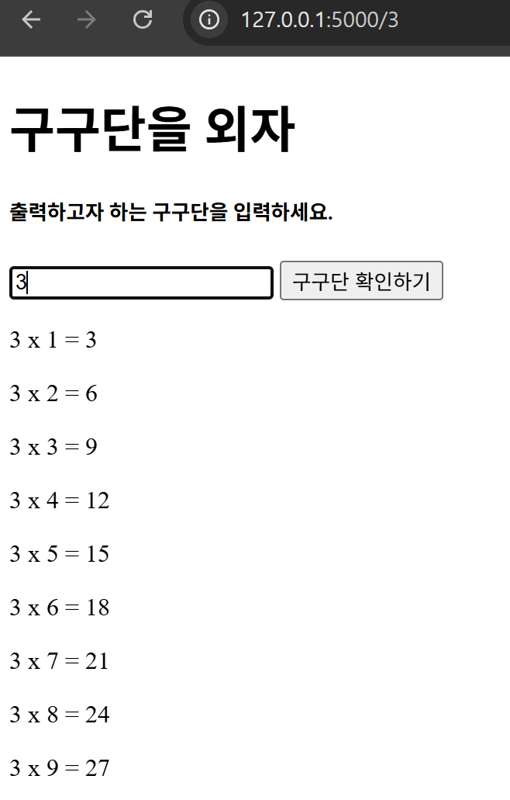
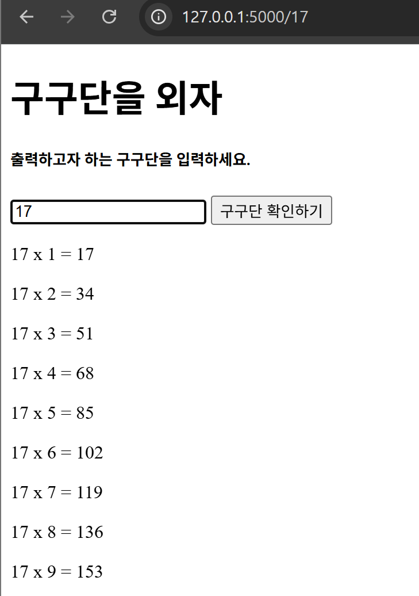
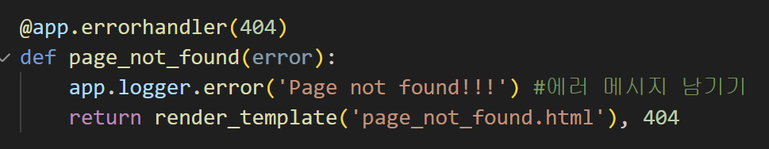
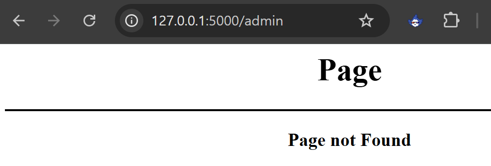

## 라우팅과 렌더링, 정적 파일

### pip로 플라스크 설치

- pip: 파이썬의 패키지 관리자
- pip install [패키지 이름] 형식으로 설치
- 마이크로 프레임워크인 플라스크는 **필요할 때마다 외부 모듈을 별도 설치**함

### 플라스크 앱 구조

- 플라스크 앱은 다음 과정을 통해 호출된다
  - 특정 URL 호출
  - 뷰 함수 호출
  - 논리 실행
  - 논리 결과 응답 전송
  - 응답 값 HTML 표현
  - 클라이언트 전달

### 플라스크 시작하기

- 플라스크: 파이썬 웹 마이크로 프레임워크, 백엔드 서버 기능
- WSGI: Web Server Gateway Interface, 앱 규격
  - Werkzug + Jinja 템플릿 엔진 구성
- 기본 5000번 포트 사용

### 데코레이터

- 플라스크를 포함해 다른 오픈소스 코드에 @로 시작하는 구문을 쉽게 접할 수 있음
- @~구문을 decorator로 부름
- 대상 함수를 감싸 함수의 앞 뒤 등 부가적으로 구문을 추가해 반복 작업에 사용
- 손쉽게 재사용이 가능해 편의와 효율 보장

### 데코레이터 배경

- 함수의 시작과 끝을 알리는 문구를 출력하기 위해 시작과 끝 부분에 함수마다 print 구문 입력

### 데코레이터 직접 만들기

- 다음은 함수의 시작과 끝을 출력하는 데코레이터
  - 데코레이터 check는 호출할 함수를 매개변수로 받으며 안에서 wrapper로 호출할 함수를 감싸는 함수 선언
  - 선언한 데코레이터를 사용하기 위해 데코레이터에 함수를 넣고 호출함

### 플라스크 정적 라우팅

- 플라스크는 복잡한 URI를 쉽게 함수로 연결하는 방법을 제공
- route() 함수 사용 앱 객체 제어
- 예제) 01_hello 폴더 확인

### 플라스크 동적 라우팅

- 동적 라우팅: 상황에 따라 변화하는 URI 적용
- URL을 "<변수>" 형태로 사용
- 예제) 02_dynamic 폴더 확인

### 플라스크 HTML 렌더링

- HTML 파일을 플라스크 웹 서버에서 띄워보자
- 플라스크는 기본 HTML 코드를 반환하면 페이지로 렌더링함
- 예제) 03_html_render 폴더 확인
- 보통 templates 폴더에 넣어서 사용함

### 플라스크 정적 파일: CSS 가져오기

- CSS 파일을 플라스크 웹 서버에 적용해보자
- CSS => static, 고정
- 예제) 04_file_import 폴더 확인

---

## GET POST 요청 처리

### HTTP 메서드

- 웹 페이지는 HTTP/HTTPS 프로토콜 사용 통신
  - HTTP: HyperText Transfer Protocol, 웹 상 정보 통신 프로토콜
  - HTTPS: HTTP + 보안
- HTTP: 리소스 상태 표현
  - http://127.0.0.1:5000/ => 127.0.0.1은 본인 ip, 안전 보장할 이유 X
  - https://www.naver.com/ => 네이버 서비스는 보안 필요
- HTTP 메서드: 서버 요청 방법, 명령 내리기
  - **GET**: 리소스 취득
  - **POST**: 엔티티 바디 전송
  - **PUT**: 파일 전송
  - **HEAD**: 메시지 헤더 취득
  - **DELETE**: 파일 삭제
  - **TRACE**: 경로 조사
  - **CONNECT**: 프록시에 터널링 요구
  - **OPTIONS**: 응답 가능 메소드 요청

### HTTP 상태 코드

- HTTP 상태 코드: HTTP 통신 응답 상태를 코드로 분류
  - 웹페이지 요청이 잘 요청되고 응답이 왔는지, 잘못 받아들여졌는지, 그럼 누구 문제인지.
- 1xx: 정보성
- 2xx: 성공
- 3xx: 리다이렉션
- 4xx: 클라이언트에서 발생한 에러
- 5xx: 서버 에러

| **100** 계속           | **101** 프로토콜 변환 |                           |                          |                       |                          |
| ---------------------- | --------------------- | ------------------------- | ------------------------ | --------------------- | ------------------------ |
| **200** 확인           | **201** 만듦          | **202** 수락              | **203** 비신뢰           | **204** 내용 없음     | **205** 내용 복귀        |
| **300** 특수 선택      | **301** 영구 이동     | **302** 찾음              | **303** 참고 항목        | **304** 수정되지 않음 | **305** 프록시           |
| **400** 잘못된 요청    | **401** 권한 없음     | **402** 지불 필요         | **403** 금지             | **404** 찾을 수 없음  | **405** 메서드 비허용    |
| **500** 내부 서버 오류 | **501** 비구현        | **502** 잘못된 게이트웨이 | **503** 서비스 사용 불가 | **504** 시간 초과     | **505** HTTP 버전 미지원 |

### 플라스크 GET 요청

- 플라스크 요청 정보는 requests에 담김(객체 안정 보장)
- requests 모듈은 HTTP 메서드 정보를 얻는 속성을 가짐
- **예제) 01_GET 폴더 확인**

### 플라스크 POST 요청

- POST 방식: 전달하려는 정보가 HTTP Body에 포함됨
- POST 요청은 주로 입력창에서 발생 => 입력 값 Body로 전송
- /post URL은 데이터가 POST로 들어올때만 동작
- **예제) 02_POST 폴더 확인**

### 플라스크 GET POST 능동 처리

- 메서드 에러 예외처리로 같은 URL 주소에서 요청에 따라 다른 페이지를 호출해보자
- **예제) 03_GET POST 폴더 확인**

---

## Jinja2 템플릿 엔진 파악

### 동적 웹 페이지 구성을 위한 Jinja2 템플릿 엔진

- 신사2 템플릿 엔진: 동적 HTML 구성 + 특수문자/웹 보안 처리
- 변수 처리
  - In python file,
    `return render_temlpate('test.html', msg=msg)`
  - In HTML file,
    `{{msg}}`
  - 콤마로 데이터 구분
- 주석
  `{# ... #}`
- 조건문
  - if 구문으로 변수나 변수 이용 표현을 사용해 존재 여부, 변수 값, bool값으로 판단
  - 반드시 조건문이 끝나고 ``를 붙여줘야 함
    ``
    `  <코드>`
    ``
- 반복문
  - 일반적인 for 반복 구조와 유사, 리스트로 값 호출
  - 조건문과 동일한 구조
- 반복문, 인덱스
  - 리스트 반복문 중 loop.index를 사용하면 인덱스를 반환
- 반복문, 표현식 사용
  - `loop.index0`: 루프내 순서로 0부터 표시
  - `loop.first`: 루프 첫 순서면 true
  - `loop.last`: 루프 마지막 순서면 true
  - `loop.length`: 전체 반복 횟수
- 신사2는 기본 줄 끝 개행 문자 제외 공백은 제거하지 않음
  - +: 태그 앞 공백 제거(시작 태그)
  - -: 태그 시작과 끝 공백 제거
- 이스케이핑
  - 특수 목적 문자열 의미 제거
  - 따옴표로 일반적인 문자열로 처리
- 형 변환
  - {{ 데이터 | 변환할 자료형 }}
    `{{number|int}}`
  - 포맷팅, 세자리 수마다 숫자 콤마 추가
    `{{ '{:,}'.format(number[0])}}`
- 매크로
- 다른 템플릿 내용 포함하기
  - extends: 기본이 되는 부모 템플릿이 있고 자식 템플릿은 부모 템플릿을 기반으로 내용 상송(override)
  - include: 다른 템플릿의 내용을 포함하여 보여줌

### 연습문제로 동적 웹 페이지 확인하기

- 동적 html 구성: url에 username을 바꾸면 페이지 화면에 바뀐 username이 적용되어서 보임
  
  
- 구구단 페이지
  
  

---

## 에러 처리와 로깅

### 에러 처리

- 플라스크는 HTTP 상태 코드를 지정해 처리하는 방식 제공
- errorhandler로 에러 처리
- 응답 값으로 error status code를 넘기지 않으면 없는 페이지에 요청 성공 인식
- 없는 페이지(admin)은 내가 지정한 함수로 처리하여 사용자 경험을 개선
  
  

### 로깅

- 로깅: 로그를 남기는 작업
- 로그?왜? => 어떤 오류나 특정 요청 발생 기록을 통해 디버깅을 할 수 있다!
- logger 인스턴스 사용
  `app.logger.error('An error ocurred') #에러 메시지 남기기`
- python Logging 모듈을 사용해 심층적인 로깅 가능
  - 로그 파일 저장
  - 로깅 레벨 저장 (특정 상황에만 로그를 남기도록)
  - 로그 내용 이메일 발송

### 디버깅

- 디버깅: 오차, 설계상 오류 등을 찾아 고치는 작업
- 플라스크의 run() 서버는 디버그 정보를 보여주는 기능 제공
- debug 모드로 서버를 열면 개발 서버를 다시 열 필요 없이 코드 수정 결과 동적 반영
