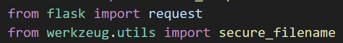
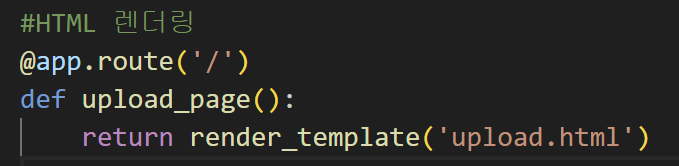
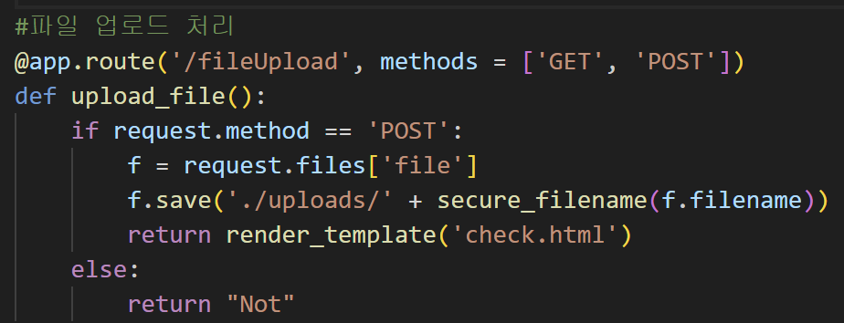
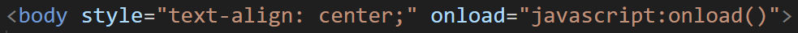
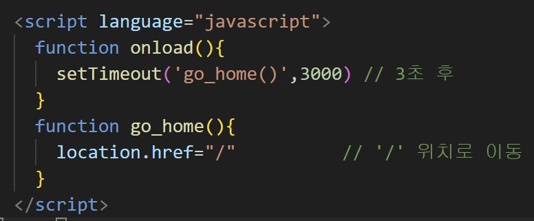
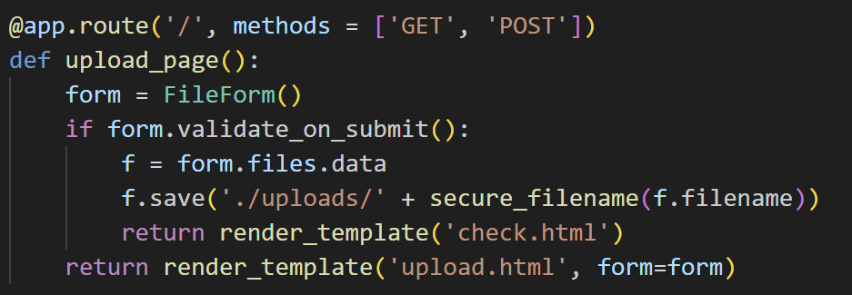
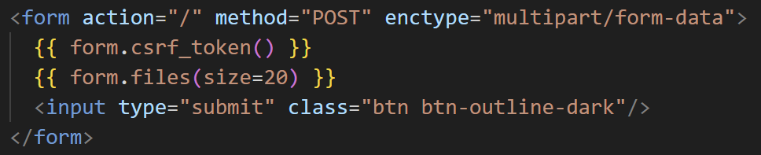
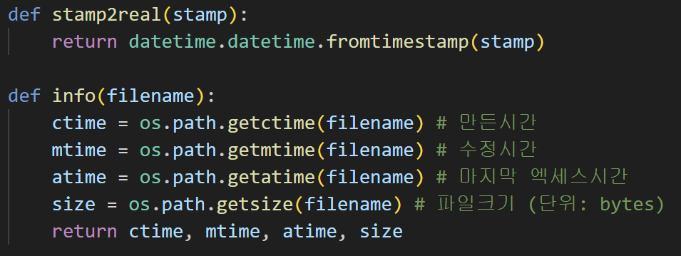
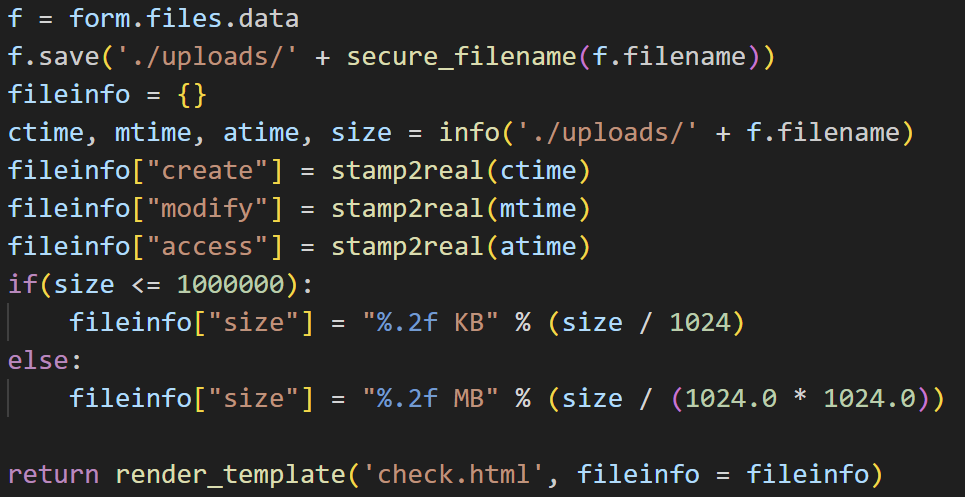
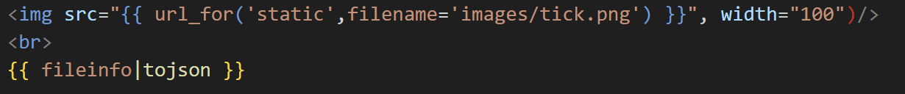

# 프로젝트 진행 - 파일 서버 만들기!

---

## 프로젝트 개요

### preview

- 상황
  - 원격지에서 파일을 내 컴퓨터로 얼리거나 내 컴퓨터에 있는 파일을 다운로드, 필요 없는 파일 제거 등 파일 관리
- 코드

  - https://github.com/neltia/Flask-FileService-app

- 파일 업로드
  - 파일 목록 위 업로드할 파일 선택 버튼을 배치
- 파일 업로드 확인
  - 성공 메시지 띄우기
- 파일 업로드 검증
  - 업로드 된 파일이 없을 때 제출 버튼을 눌렀다면 제출이 안 되게 방지
- 파일 정보 확인
  - 파이썬의 OS 운영체제 모듈과 datatime 모듈(내부모듈)로 쉽게 파일 정보 확인 가능
- 파일 목록 나열
  - 파일 확장자/파일 이름/만든 날짜/마지막 수정 날짜/파일 크기 등
- 파일 다운로드
  - 나열된 목록에서 파일 이름을 선택하면 해당 파일 다운로드, 삭제 버튼을 누르면 삭제되도록 기능 추가
  - 추가로 잘못된 페이지로 접근하면 페이지 비정상 접근 메시지 표시

### project tree

- 완성될 프로젝트 구성 내용
  - static: image
  - templates: HTML 템플릿
  - uploads: 파일이 업로드 될 폴더

### Library

- 프로젝트 사용 라이브러리
  - 다음 라이브러리가 사용
    `from flask import flask, rander_tamplate, request, redirect, url_for, send_file`
    `from flask_wtf import FlaskForm`
    `from flask_wtf.file import secure_filename`
    `from werkzeug.utils import secure_filename`
    `import os, datetime, time`

---

## step1. 파일 업로드

### Tech. 파비콘 설정

- 파비콘: Favicon, 인터넷 웹 브라우저의 주소창에 표시되는 웹 페이지를 대표하는 아이콘
  
- 표시할 아이콘 준비
  - FlatIcon: https://www.flaticon.com/
    - 무료 픽토그램 제공
  - convertico: https://convertico.com/
    - 이미지를 .ico 파일로 변환

### Tech.Jinja2 block과 extends

- base.html 구성하기
  - 보다 복잡한 프로젝트를 구성하면 내용을 간소화하고 분할하는 작업이 필수
  - 보통 base.html을 만들어 모든 HTML 파일의 공통적인 부분을 기록함
    - extends로 다른 html에서 base를 상속받도록!

### Tech.Flask 파일 업로드

- 파일을 선택해 업로드하면 파일 서버가 실행되는 경로의 uploads 폴더에 저장
- 파일 업로드 처리를 위한 모듈 - request, secure_filename
  
- 파일 업로드 페이지 이동
  
- 파일 업로드 처리
  

- secure_filename의 역할
    - 사용 이유: '절대 사용자의 입력을 밎지 마라' 원칙기반
    - 모든 경로의 데이터를 가져오지 못하게 함
        - 해킹 방지
### Tech. 자바스크립트 n초 뒤 경로 이동
- 파일 저장 후 업로드 완료를 나타내는 check.html

### Tech. 업로드 용량 제한
- 업로드 용량 제한과 플라스크 앱 설정
    - app.config["설정 항목]으로 플라스크 앱에 여러 설정 가능
    - MAX_CONTENT_LENGTH로 업로드 파일의 용량 제한 가능
    `app = Flask(__name__)`
    `# app.config['MAX_CONTENT_LENGTH'] = 16 * 1024 * 1024`
---

## step2. 파일 검증
### Tech.Flask_wtf
- step1에서 구성한 기본 파일 업로드 페이지는 파일을 선택하지 않고 제출 버튼을 누르면 오류 발생
    - 따라서 파일을 선택하고 제출 버튼을 누르도록 파일 검증이 필요 = **폼 유효성 검사**
- Flask-WTF: 플라스크에서 폼을 관리하는 기능 제공
- HTML에서 form을 사용하지 않고 python에서 폼을 만들어 다음 기능 등 이용 가능
    - 쉽고 유연한 폼 적용
    - 다수의 폼 관리도 편하게
    - CSRF 보호
    - 유효성 검증
    - 리캡처(나는 로봇이 아닙니다 그거..)
- `pip install flask-wtf`

### Tech.CSRF 공격과 secret_key
- 사용할 Flask-WTF 모듈
    - FlaskForm, FileField, FileRequired
    `from flask.wtf import FlaskForm`
    `from flask.wtf.file import FileField, FileRequired`
- Flask-WTF를 사용하기 위해서는 환경변수 Secret_key가 필요
    - CSRF 공격을 방지하기 위한 토큰
    - form으로 전송된 데이터가 실제 웹에서 작성된 데이터인지 위조한 스크립트인지 판단하는 역할
    - 코드에서는 임의로 secret을 입력했지만 보안을 위해 실제 환경은 유추하기 어려운 문자열을 사용할 것

### Tech.파일 검증
- 불러온 Flask-WTF 모듈들을 활용해 폼을 작성해 HTML로 보내면서 유효성 검사 수행
    - FileForm 클래스 선언: validators로 FileField가 담김
    `class FileForm(FlaskForm):`
        `files = FileField(validators=[FileRequired('업로드할 파일을 넣어주세요')])`
    - 선언한 클래스를 form 변수에 넣고 값이 든 상태일 때만 데이터를 넘기며 form은 HTMK에 인자로 전달
    
    - upload.html에는 기존 form 태그 내용 대신 전달된 form 내용과 csrf 토큰이 담김
    

---

## step3. 파일 정보 확인
- 코드 확인:
    - 04_FileServer/step3
- 진행 내용:
    - 날짜 데이터 처리
    - 파일 정보 확인
    - 웹에 파일 정보 출력

### Tech. 날짜 데이터 처리
- 업로드된 파일의 정보를 메인 화면에 출력할 수 있도록 먼저 파일 정보를 확인하는 법을 알아볼 것
- 파일 우클릭 - 속성 탭에서 확인할 수 있는 정보를 가져옴
    - 가져올 파일 정보: uploads 폴더 파일의 생성 날짜, 수정 날짜, 액세스 날짜, 파일 크기
- 데이터 분석에서 빠질 수 없는 자료형, 날짜 데이터!
파이썬의 날짜와 시간 처리 클래스가 저장된 대표 모듈인 datetime과 time 사용

### Tech. 파일 정보 확인
- 코드. fileinfo.py
    - 사용 모듈 호출
    `import os, datetime, time`
    - 파일 정보 확인을 위한 처리 함수 선언
    
    - 시간 출력과 파일 크기 변환 후 출력

### Tech. 웹에 파일 정보 출력
- @app.route('/') 데코레이터 위에 파일 정보 확인을 위한 함수 선언
- 파일 저장 후 파일을 가져와 정보를 딕셔너리 자료로 check.html에 전달

- json 데이터는 jinja2에서 깨짐없이 표현하기 위해 웹의 딕셔너리 구조인 json으로 형 변환

