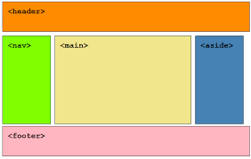

## 프로젝트 개요

### 상황

개인 혹은 팀이 쓸 수 있는 해야 할 일과 중요도가 표현된 할 일 목록 페이지가 필요한 상황 (추가/삭제/수정 가능)

### Preview

- Nav와 Foote, 반응형 이미지 적용
  
- 메모 입력
- 메모 목록
- 상태에 따른 메모 표시
- 삭제
- 수정

### Library

- 프로젝트 사용 라이브러리
  `from flask import Flask`
  `from flask import render_template`
  `from flask import request`
  `from wtforms import StringField`
  `from flask_wtf import FlaskForm`
  `from wtforms.validators import DataRequired`
  `from pymongo import MongoClient`
  `from bson import ObjectId`
  `from datetime import datetime`

---

## 데이터베이스 기초

### 데이터베이스란?

- 여러 사람이 공유해 사용할 목적으로 체계화해 통합, 관리하는 데이터 집합
- DB: 행과 열로 이루어진 표 형태(=엑셀 시트)

### 데이터베이스 용어

- **데이터베이스 시스템**: 응용 프로그램 + DBMS + DB
- **데이터 베이스 관리자(DBA)**: 데이터베이스 시스템 및 자원 기획/통제 사람 혹은 조직
- **데이터 베이스 구성요소**: 개체, 속성, 관계
  열: 필드, 속성
  행: 튜플, 레코드
- **스키마**: 데이터베이스의 구조와 제약 조건에 대한 명세 기술, 메타데이터 집합
  - 외부 스키마: 사용자 요구 사항을 도출하는 과정
  - 개념 스키마: 외부 스키마를 분석해 저장해야 하는 정보 도출
  - 내부 스키마: 논리 스키마를 컴퓨터 내부에 저장할 수 있는 물리적 구조로 변환한 것
- **스키마 특징**
  - data dictionary, 메타 데이터
  - 시간에 따라 불변, 데이터 구조적 특성 의미, 인스턴스에 의해 규정
- **외부 스키마(사용자 뷰) <=> 개념 스키마(전체 뷰) <=> 내부 스키마(저장)**
- **SQL**: sturctured Query Language, 표준 관계형 데이터베이스 언어
  - DDL, DML, DCL
- DDL: 데이터 정의어, 물리적 데이터베이스 정의/관리
  - CREATE, DROP. ALTER
- DML: 데이터 조작어, 생성된 데이터베이스 데이터 처리/CRUD
  - SELECT, INSERT, UPDATE, DELETE
- DCL: 데이터베이스 권한, 무결성 등을 관리
  - GRANT, ROLLBACK 등

### 데이터베이스 종류

- 데이터베이스느
