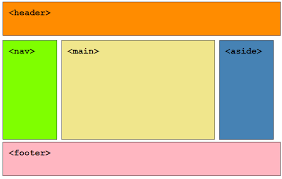

## 프로젝트 개요

### 상황

개인 혹은 팀이 쓸 수 있는 해야 할 일과 중요도가 표현된 할 일 목록 페이지가 필요한 상황 (추가/삭제/수정 가능)

### Preview

- Nav와 Foote, 반응형 이미지 적용
  
- 메모 입력
- 메모 목록
- 상태에 따른 메모 표시
- 삭제
- 수정

### Library

- 프로젝트 사용 라이브러리
  `from flask import Flask`
  `from flask import render_template`
  `from flask import request`
  `from wtforms import StringField`
  `from flask_wtf import FlaskForm`
  `from wtforms.validators import DataRequired`
  `from pymongo import MongoClient`
  `from bson import ObjectId`
  `from datetime import datetime`

---

## 데이터베이스 기초

### 데이터베이스란?

- 여러 사람이 공유해 사용할 목적으로 체계화해 통합, 관리하는 데이터 집합
- DB: 행과 열로 이루어진 표 형태(=엑셀 시트)

### 데이터베이스 용어

- **데이터베이스 시스템**: 응용 프로그램 + DBMS + DB
- **데이터 베이스 관리자(DBA)**: 데이터베이스 시스템 및 자원 기획/통제 사람 혹은 조직
- **데이터 베이스 구성요소**: 개체, 속성, 관계
  열: 필드, 속성
  행: 튜플, 레코드
- **스키마**: 데이터베이스의 구조와 제약 조건에 대한 명세 기술, 메타데이터 집합
  - 외부 스키마: 사용자 요구 사항을 도출하는 과정
  - 개념 스키마: 외부 스키마를 분석해 저장해야 하는 정보 도출
  - 내부 스키마: 논리 스키마를 컴퓨터 내부에 저장할 수 있는 물리적 구조로 변환한 것
- **스키마 특징**
  - data dictionary, 메타 데이터
  - 시간에 따라 불변, 데이터 구조적 특성 의미, 인스턴스에 의해 규정
- **외부 스키마(사용자 뷰) <=> 개념 스키마(전체 뷰) <=> 내부 스키마(저장)**
- **SQL**: sturctured Query Language, 표준 관계형 데이터베이스 언어
  - DDL, DML, DCL
- DDL: 데이터 정의어, 물리적 데이터베이스 정의/관리
  - CREATE, DROP. ALTER
- DML: 데이터 조작어, 생성된 데이터베이스 데이터 처리/CRUD
  - SELECT, INSERT, UPDATE, DELETE
- DCL: 데이터베이스 권한, 무결성 등을 관리
  - GRANT, ROLLBACK 등

### 데이터베이스 종류

- 관계형 데이터베이스
  - MySQL, MS-SQL, Maria DB, SQLite
- NoSQL 데이터베이스
  - Document - MongoDB: collection 데이터 모델 구조
  - Key-Redis: 키와 값의 데이터가 쌍으로 저장되는 단순 구조
  - Big Table - Hbase:키-값 형에서 column family 모델 구조
- 계층형, 네트워크 등

### Mongo DB

- 데이터 객체가 컬렉션 내부에서 독립된 문서로 저장되는 문서 모델 기반 NoSQL DB
  몽고 DB는 컬렉션을 사용해 데이터를 하나로 묶음 - 컬렉션: 용도가 같거나 유사한 문서 그룹화, 기존 SQL DB 테이블처럼 동작ㄱ
- 문서: 몽고 DB 내 하나의 실제 데이터
  - 문서는 내부 하위 문서 포함, 앱에 가까운 고유 데이터 모델 제공, Bson으로 저장
- 몽고 DB's feature
  - 필드 이름: null, 점, $ 불가능
  - 최대 문서 크기: 16MB
- 기본 포트 27017번 사용
- 동적 스키마

### Robomongo 3T 설치

- MongoDB 관리 도구로 CLI 환경 작업을 GUI 버전으로 제공

### RDBMS와 MongoDB 비교

- 개념/서버와 클라이언트 주제

| RDB(MySQL)  | MongoDB                      |
| ----------- | ---------------------------- |
| Database    | Database                     |
| Table       | Collection                   |
| Tuple / Row | Document or BSON document    |
| Column      | Field                        |
| Table Join  | Embedded Documents & Linking |
| Primary Key | Primary Key (\_id)           |

- SQL 질의문 차이
  | 연산 | RDB(MySQL) | MongoDB |
  |--------|---------------------------------------------------------|------------------------------------------------------------------|
  | Insert | `insert into users ("name", "city") values("lee", "seoul")` | `db.users.insert({ name: "lee", city: "seoul" })` |
  | Select | `select * from users where name="lee"` | `db.users.find({ name: "lee" })` |
  | Update | `update users set city="busan" where name="lee"` | `db.users.update({ name: "lee" }, { $set: { city: "busan" } })` |
  | Delete | `delete from users where name="lee"` | `db.users.remove({ name: "lee" })` |
